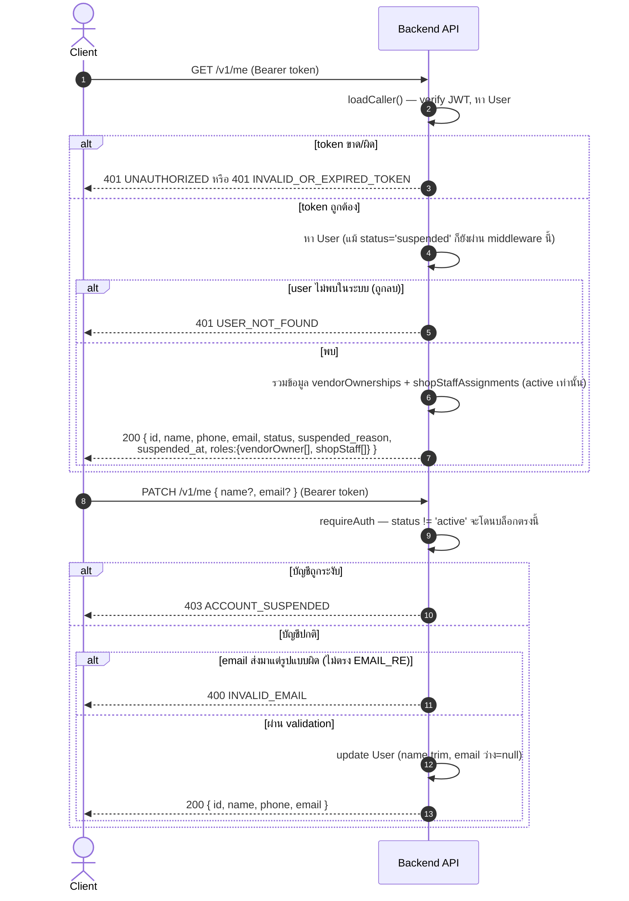
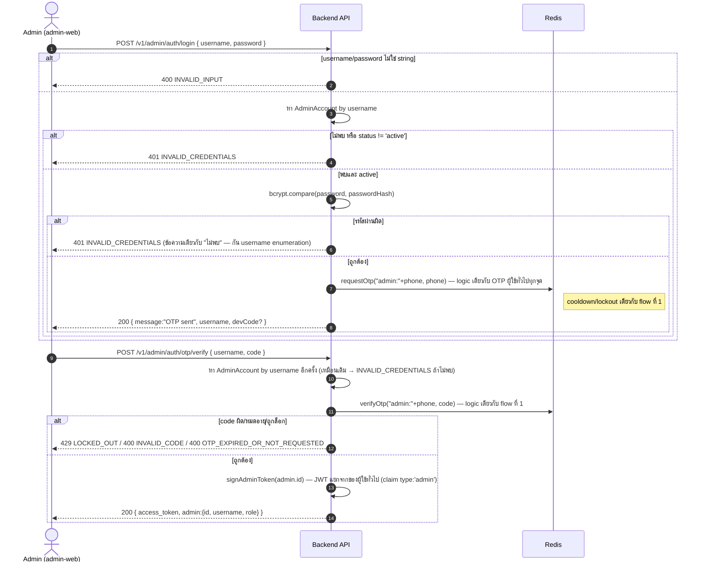

# Sequence Diagrams — Auth & Profile

> อ้างอิงจากโค้ดจริงใน `backend/src/routes/auth.js`, `backend/src/middleware/auth.js`,
> `backend/src/services/{otp,jwt}.js` ครอบคลุมทุก endpoint, ทุก error case ที่มีจริงในโค้ด — ไม่ใช่แผนหรือของที่ยังไม่ได้ทำ

ทุก endpoint ในไฟล์นี้อยู่ใต้ prefix `/v1` (mount ที่ `backend/src/app.js`) — `auth.js` (default export)
mount ที่ `/v1/auth`, `.meRouter` mount แยกที่ `/v1/me`

## 1. สมัคร/เข้าสู่ระบบด้วย OTP (ทางหลัก — ลูกค้า/ร้านค้า/staff ใช้ร่วมกัน)

ใช้ endpoint ชุดเดียวกัน แต่**สมัครกับเข้าสู่ระบบแยกกันชัดเจน** (อัปเดต 27 ก.ย. 2026): client ต้องส่ง
`purpose: 'login' | 'register'` ทั้งตอนขอและตอนยืนยัน OTP
- `login` — **ไม่สร้างบัญชีให้** เบอร์ที่ยังไม่เคยสมัครได้ 404 `NOT_REGISTERED` (แอปพาไปหน้าสมัคร)
- `register` — สร้างบัญชีใหม่ เบอร์ที่มีบัญชีแล้วได้ 409 `ALREADY_REGISTERED` (แอปพาไปหน้าเข้าสู่ระบบ)
- ขาด/ค่าอื่น → 400 `INVALID_PURPOSE`

เดิมเข้าสู่ระบบด้วยเบอร์ไหนก็ได้และระบบสร้างบัญชีให้อัตโนมัติ — เปลี่ยนเป็นต้องสมัครก่อนเสมอ

```mermaid
sequenceDiagram
    autonumber
    actor C as Client (Mobile)
    participant API as Backend API
    participant PG as PostgreSQL
    participant R as Redis

    C->>API: POST /v1/auth/otp/request { phone, purpose }
    API->>API: ตรวจ phone ตรง PHONE_RE (/^0\d{9}$/)
    alt phone รูปแบบผิด
        API-->>C: 400 INVALID_PHONE
    else purpose ไม่ใช่ login/register
        API-->>C: 400 INVALID_PURPOSE
    else ข้อมูลถูกต้อง
        API->>PG: findUnique User by phone
        alt purpose = login และยังไม่มี User
            API-->>C: 404 NOT_REGISTERED ("เบอร์นี้ยังไม่ได้สมัครสมาชิก กรุณาสมัครก่อน")
        else purpose = register และมี User แล้ว
            API-->>C: 409 ALREADY_REGISTERED ("เบอร์นี้สมัครแล้ว กรุณาเข้าสู่ระบบ")
        else ผ่าน — ขอ OTP ต่อ
        API->>R: เช็ค otp:lockout:&lt;phone&gt;
        alt ติด lockout (ผิดครบ 5 ครั้งในรอบก่อน)
            R-->>API: key มีอยู่
            API-->>C: 429 LOCKED_OUT ("ลองผิดเกินกำหนด กรุณารอสักครู่")
        else ไม่ติด lockout
            API->>R: เช็ค otp:cooldown:&lt;phone&gt;
            alt ยังอยู่ในช่วง cooldown (&lt;60 วิจากครั้งก่อน)
                R-->>API: key มีอยู่
                API-->>C: 429 COOLDOWN_ACTIVE ("รอ 60 วินาทีก่อนขอรหัสใหม่")
            else ขอรหัสใหม่ได้
                API->>API: สุ่มรหัส 6 หลัก, SHA-256 hash
                API->>R: SET otp:code:&lt;phone&gt; = hash (TTL 300s)
                API->>R: SET otp:cooldown:&lt;phone&gt; (TTL 60s)
                API->>R: DEL otp:attempts:&lt;phone&gt;
                API->>API: sendSms() — dev mode: แค่ log, ไม่ส่งจริง
                API-->>C: 200 { message:"OTP sent", devCode } (devCode เฉพาะ NODE_ENV != production)
            end
        end
        end
    end

    Note over C,API: === ผู้ใช้กรอกรหัส (จาก devCode ตอน dev หรือ SMS จริงตอน production) ===

    C->>API: POST /v1/auth/otp/verify { phone, code, purpose }
    alt phone ผิดรูปแบบ หรือ code ไม่ใช่ string
        API-->>C: 400 INVALID_INPUT
    else purpose ไม่ใช่ login/register
        API-->>C: 400 INVALID_PURPOSE
    else input ถูกต้อง
        API->>R: GET otp:code:&lt;phone&gt;
        alt ไม่มีรหัสเก็บไว้ (หมดอายุ/ไม่เคยขอ)
            API-->>C: 400 OTP_EXPIRED_OR_NOT_REQUESTED
        else มีรหัสอยู่
            API->>API: เทียบ hash
            alt รหัสผิด
                API->>R: INCR otp:attempts:&lt;phone&gt; (TTL 300s)
                alt ผิดครบ 5 ครั้ง
                    API->>R: SET otp:lockout:&lt;phone&gt; (TTL 900s)
                    API->>R: DEL otp:code:&lt;phone&gt;
                    API-->>C: 429 LOCKED_OUT
                else ยังไม่ครบ 5 ครั้ง
                    API-->>C: 400 INVALID_CODE
                end
            else รหัสถูก
                API->>R: DEL otp:code / otp:attempts / otp:cooldown
                API->>PG: findUnique User by phone (เช็คซ้ำหลังรหัสถูก — กันเรียก verify ตรงๆ)
                alt purpose = login และไม่มี User
                    API-->>C: 404 NOT_REGISTERED (ไม่สร้างบัญชี)
                else purpose = register และมี User แล้ว
                    API-->>C: 409 ALREADY_REGISTERED
                else ผ่าน
                    opt purpose = register
                        API->>PG: create User { phone, name: phone } (isNewUser = true)<br/>แอป PATCH /v1/me ชื่อ/อีเมลจริงต่อทันที
                    end
                    API->>API: signToken(user.id) — JWT 7 วัน, secret จาก JWT_SECRET
                    API-->>C: 200 { access_token, user:{id,phone,name}, isNewUser }
                end
            end
        end
    end
```

## 2. ดู/แก้ไขโปรไฟล์ตัวเอง

`GET /v1/me` ใช้ `requireAuthAllowSuspended` โดยตั้งใจ — บัญชีที่ถูกระงับก็ยังต้องเห็นเหตุผลว่าทำไมถูกระงับ
ส่วน `PATCH /v1/me` ใช้ `requireAuth` เต็ม (บัญชีระงับแก้โปรไฟล์ไม่ได้ — ไม่ใช่ช่องทางอุทธรณ์)



## 3. เข้าสู่ระบบฝั่งแอดมิน (username/password + OTP สองชั้น)

คนละ namespace กับ OTP ผู้ใช้ทั่วไป (`otpKey = "admin:"+phone` กัน key ชนกันใน Redis) — ดูรายละเอียด
`AdminAccount`/`AdminJWT` เพิ่มที่ [10-admin-accounts-and-superadmin.md](./10-admin-accounts-and-superadmin.md)


