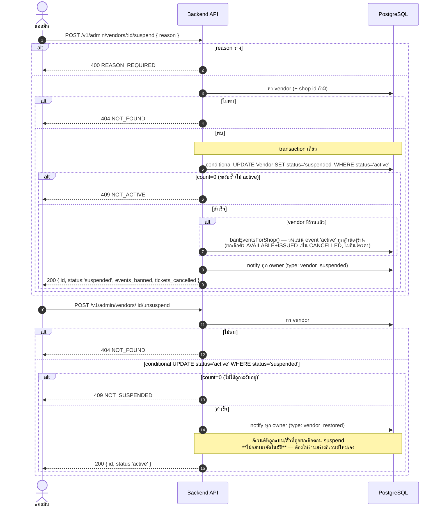

# Sequence Diagrams — Vendor Onboarding & Moderation

> อ้างอิงจาก `backend/src/routes/vendors.js`, `backend/src/services/{quota,moderation}.js`

ต้องเป็น vendor ที่ `verificationStatus:'approved'` ก่อน ถึงจะสร้างร้าน (shop) ได้ — ดู
[03-shop-and-staff.md](./03-shop-and-staff.md) ต่อ

## 1. สมัครเป็นร้านค้า พร้อมแนบเอกสารยืนยันตัวตน

`POST /v1/vendors` — multipart, แนบไฟล์ได้สูงสุด 3 ไฟล์ (field `documents`), แต่ละไฟล์ ≤5MB,
ต้องเป็น image/jpeg, image/png หรือ application/pdf

```mermaid
sequenceDiagram
    autonumber
    actor U as ผู้ใช้ (login แล้ว)
    participant API as Backend API
    participant FS as ไฟล์ระบบ (uploads/)
    participant PG as PostgreSQL

    U->>API: POST /v1/vendors (multipart: name, documents[])
    alt name ว่าง/ไม่ใช่ string
        API-->>U: 400 INVALID_NAME
    else มี name
        loop ทุกไฟล์ที่แนบมา
            alt mimetype ไม่ใช่ jpeg/png/pdf
                API-->>U: 400 { error: INVALID_FILE_TYPE, file }
            else ไฟล์ใหญ่เกิน 5MB
                API-->>U: 400 { error: FILE_TOO_LARGE, file }
            end
        end
        API->>PG: หา VendorOwnership ของ user นี้
        alt มี vendor อยู่แล้ว
            API-->>U: 409 ALREADY_HAS_VENDOR
        else ยังไม่มี
            API->>FS: เขียนไฟล์ทุกไฟล์ลง uploads/vendors/&lt;uuid&gt;/
            API->>PG: create Vendor + owners:[{userId,role:'owner'}]<br/>+ verification:{status:'pending'} + documents:[...]
            alt DB error ระหว่างสร้าง
                API->>FS: unlink ไฟล์ที่เขียนไปแล้ว (best-effort cleanup)
                API-->>U: 500 INTERNAL_ERROR
            else สำเร็จ
                API-->>U: 201 { vendor พร้อม verification, documents }
            end
        end
    end
```

## 2. แอดมินตรวจสอบและตัดสินใจอนุมัติ/ปฏิเสธ

```mermaid
sequenceDiagram
    autonumber
    actor A as แอดมิน
    participant API as Backend API
    participant PG as PostgreSQL

    A->>API: GET /v1/admin/vendors?status=pending
    API->>PG: หา VendorVerification ตาม status ที่กรอง (รวม vendor + เอกสาร)
    API-->>A: 200 [รายการรอตรวจ]

    A->>API: GET /v1/admin/vendors/:id
    API->>PG: หา Vendor เต็ม (verification, reviewer, owners, shop, documents)
    alt ไม่พบ
        API-->>A: 404 NOT_FOUND
    else พบ
        API-->>A: 200 &lt;vendor เต็ม&gt;
    end

    A->>API: POST /v1/admin/vendors/:id/decision { decision, reason }
    alt decision ไม่ใช่ approved/rejected
        API-->>A: 400 INVALID_DECISION
    else reason ว่าง
        API-->>A: 400 REASON_REQUIRED
    else input ถูกต้อง
        API->>PG: update VendorVerification{status,reason,reviewedAt}<br/>+ update Vendor.verificationStatus (sync กัน)
        alt decision == approved
            API->>API: ensureVendorQuota() — idempotent
            API->>PG: หา Package code:'free'
            API->>PG: create VendorQuota{ticketBalance, eventBalance จากแพ็กเกจฟรี}
            Note right of PG: ถ้ามี VendorQuota อยู่แล้ว (เคย approve ไปแล้ว) ข้ามขั้นตอนนี้เฉยๆ
        end
        API->>PG: notify ทุก owner ของ vendor (type: vendor_verification_result)
        API-->>A: 200 &lt;verification ที่อัปเดตแล้ว&gt;
    end
```

## 3. ร้านค้ายื่นอุทธรณ์หลังถูกปฏิเสธ (สูงสุด 5 ครั้ง)

```mermaid
sequenceDiagram
    autonumber
    actor V as เจ้าของร้าน (ที่ถูกปฏิเสธ)
    participant API as Backend API
    participant PG as PostgreSQL

    V->>API: POST /v1/vendors/:id/appeal { reason }
    alt reason ว่าง
        API-->>V: 400 REASON_REQUIRED
    else มี reason
        API->>PG: หา VendorOwnership ของ user นี้ต่อ vendor นี้
        alt ไม่ใช่เจ้าของ vendor นี้
            API-->>V: 403 NOT_YOUR_VENDOR
        else เป็นเจ้าของจริง
            Note over API,PG: อัปเดตแบบ atomic เดียว กันแข่งกันยื่นพร้อมกันชน appeal cap
            API->>PG: UPDATE VendorVerification SET status='pending',<br/>appealCount+=1, lastAppealReason=reason<br/>WHERE status='rejected' AND appealCount &lt; 5
            alt อัปเดตได้ (count=1)
                API->>PG: update Vendor.verificationStatus='pending' (sync)
                API-->>V: 200 &lt;verification&gt;
            else อัปเดตไม่ได้ (count=0) — ตรวจสาเหตุ
                alt verification ไม่พบเลย
                    API-->>V: 404 NOT_FOUND
                else status ไม่ใช่ rejected อยู่แล้ว
                    API-->>V: 409 NOT_REJECTED
                else ยื่นครบ 5 ครั้งแล้ว
                    API-->>V: 429 APPEAL_LIMIT_REACHED
                end
            end
        end
    end
```

## 4. แอดมินระงับ/ปลดระงับร้านค้า (ผลกระทบต่อเนื่องถึงอีเวนต์/ตั๋ว)

การระงับร้านค้าจะ**แบนทุกอีเวนต์ที่ active ของร้านนั้นไปด้วย** (ไม่ใช่แค่ปิดร้าน) — ใช้ฟังก์ชันร่วม
`banEventsForShop` ใน `services/moderation.js`


