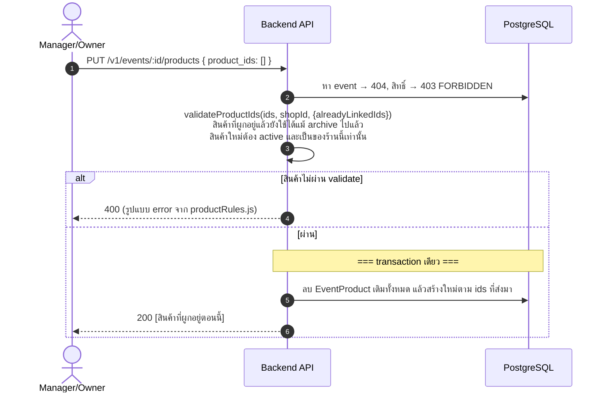

# Sequence Diagrams — Products & Reviews

> อ้างอิงจาก `backend/src/routes/{products,reviews}.js`, `backend/src/services/reviewRules.js`

## 1. จัดการสินค้าของร้าน (เพิ่ม/แก้ไข/เก็บเข้ากรุ/แนบรูป)

สินค้าไม่เคยถูกลบจริง — กด "ลบ" คือเปลี่ยนสถานะเป็น `archived` เท่านั้น (เพื่อให้อีเวนต์เก่าที่เคยผูก
สินค้านี้ไว้ยังอ้างอิงถึงได้)

```mermaid
sequenceDiagram
    autonumber
    actor M as Manager/Owner
    participant API as Backend API
    participant PG as PostgreSQL
    participant FS as ไฟล์ระบบ

    M->>API: GET /v1/shops/:shopId/products?include_archived=
    API->>API: isActiveShopMember (staff ดูได้ด้วย ไม่ต้องเป็น manager)
    alt ไม่ใช่สมาชิกร้าน
        API-->>M: 403 FORBIDDEN
    else
        API->>PG: list สินค้า (active เท่านั้น เว้นแต่ขอ include_archived)
        API-->>M: 200 [รายการสินค้า]
    end

    M->>API: POST /v1/shops/:shopId/products { name, price_baht }
    API->>API: isShopManagerOrOwner (staff เพิ่มสินค้าเองไม่ได้)
    alt ไม่ใช่ manager/owner
        API-->>M: 403 FORBIDDEN
    else name ว่าง/ยาวเกิน 200 ตัว
        API-->>M: 400 INVALID_NAME / NAME_TOO_LONG
    else ราคาไม่ใช่ตัวเลขที่ถูกต้อง (&lt;0 หรือไม่ใช่ตัวเลข)
        API-->>M: 400 INVALID_PRICE
    else ผ่าน
        API->>PG: create Product (sortOrder = จำนวนสินค้าปัจจุบัน)
        API-->>M: 201 &lt;product&gt;
    end

    M->>API: PATCH /v1/products/:id { name?, price_baht?, status? }
    API->>PG: หาสินค้า → 404 NOT_FOUND
    API->>API: isShopManagerOrOwner → 403 FORBIDDEN
    Note right of API: validate เหมือนตอนสร้าง + status ต้องเป็น active/archived เท่านั้น (400 INVALID_STATUS)
    API->>PG: update เฉพาะ field ที่ส่งมา
    API-->>M: 200 &lt;product&gt;

    M->>API: DELETE /v1/products/:id (จริงๆคือ archive)
    API->>PG: หาสินค้า → 404, สิทธิ์ → 403 FORBIDDEN
    alt archive ไปแล้ว
        API-->>M: 409 ALREADY_ARCHIVED
    else
        API->>PG: update status='archived'
        API-->>M: 200 &lt;product&gt;
    end

    M->>API: POST /v1/products/:id/image (multipart)
    API->>PG: หาสินค้า → 404, สิทธิ์ → 403 FORBIDDEN
    alt ไม่มีไฟล์ / ผิดชนิด / ใหญ่เกิน 5MB
        API-->>M: 400 NO_FILE / INVALID_FILE_TYPE / FILE_TOO_LARGE
    else
        API->>FS: เขียนไฟล์ใหม่ก่อน
        API->>PG: update product.imageUrl
        API->>FS: ลบไฟล์เก่า (เฉพาะหลัง DB สำเร็จแล้วเท่านั้น — กันข้อมูลหายถ้า DB error)
        API-->>M: 201 &lt;product&gt;
    end
```

## 2. ผูกสินค้ากับอีเวนต์



## 3. รีวิวอีเวนต์ (ต้องเคยแลกตั๋วจริงถึงรีวิวได้)

```mermaid
sequenceDiagram
    autonumber
    actor U as ผู้ใช้ (guest ดูได้ / ต้อง login ถึงรีวิวได้)
    participant API as Backend API
    participant PG as PostgreSQL
    participant FS as ไฟล์ระบบ

    U->>API: GET /v1/events/:id/reviews
    API->>PG: หา event → 404 NOT_FOUND
    API->>PG: กระจายคะแนนของ event นี้ + ค่าเฉลี่ยทั้งร้าน + รีวิวล่าสุด 50 รายการ
    alt เป็น guest (ไม่มี token หรือ token ใช้ไม่ได้)
        API->>API: can_review = false เสมอ
    else login แล้ว
        API->>API: userMayReviewEvent() — เช็คว่าเคยมีตั๋วที่แลกไปแล้วจริงไหม
        API->>API: can_review = (ไม่มี error กลับมา)
    end
    API-->>U: 200 { summary, shop_summary, can_review, my_review, reviews[] }

    U->>API: POST /v1/events/:id/reviews { rating, comment? }
    API->>API: validateReviewInput() — rating/comment ผ่านกฎ ไม่ผ่าน → 400
    API->>PG: หา event → 404 NOT_FOUND
    API->>API: userMayReviewEvent() ไม่ผ่าน (ไม่เคยแลกตั๋วจริง)
    alt ไม่มีสิทธิ์รีวิว
        API-->>U: 403 (เหตุผลจาก reviewRules.js)
    else มีสิทธิ์
        API->>PG: upsert EventReview บน (eventId, userId) — รีวิวซ้ำ = แก้ไขรีวิวเดิม
        API-->>U: 201 &lt;review&gt;
    end

    U->>API: POST /v1/events/:id/reviews/photo (multipart)
    API->>PG: หารีวิวที่มีอยู่แล้วของ U ก่อน (ต้องส่งคะแนนก่อนถึงจะแนบรูปได้)
    alt ยังไม่เคยรีวิว
        API-->>U: 404 NO_REVIEW ("ต้องส่งรีวิวก่อนถึงจะแนบรูปได้")
    else ไฟล์ไม่มี/ผิดชนิด/ใหญ่เกิน
        API-->>U: 400 NO_FILE / INVALID_FILE_TYPE / FILE_TOO_LARGE
    else ผ่าน
        API->>FS: เขียนไฟล์ใหม่
        API->>PG: update EventReview.photoUrl
        API->>FS: ลบรูปเก่า (หลัง DB สำเร็จเท่านั้น)
        API-->>U: 201 { id, photo_url }
    end

    U->>API: DELETE /v1/events/:id/reviews/me
    API->>PG: หารีวิวของ U → 404 NOT_FOUND ถ้าไม่มี
    API->>PG: ลบ EventReview จริง (จุดเดียวในระบบที่ลบข้อมูลถาวร ไม่ใช่ archive)
    API-->>U: 204 No Content
```
