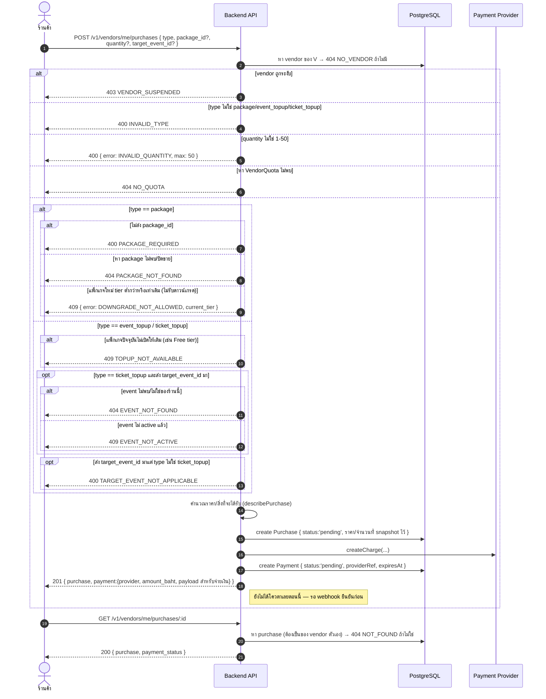
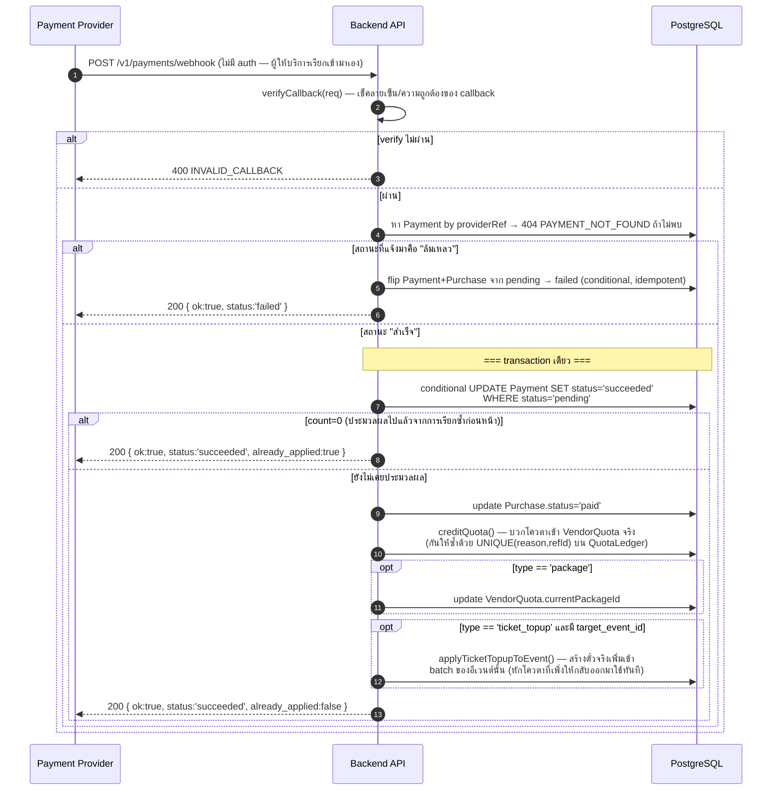

# Sequence Diagrams — Packages, Purchases & Payment

> อ้างอิงจาก `backend/src/routes/{packages,purchases}.js`, `backend/src/services/quota.js`

กติกาสำคัญ: **โควตาจะถูกให้จริงแค่จุดเดียวในระบบทั้งหมด — ตอน payment webhook ยืนยันว่าจ่ายสำเร็จ**
ไม่ใช่ตอนสร้างคำสั่งซื้อ

## 1. ดูแพ็กเกจที่มีขาย / ซูเปอร์แอดมินแก้ราคา

```mermaid
sequenceDiagram
    autonumber
    actor V as ร้านค้า
    actor SA as ซูเปอร์แอดมิน
    participant API as Backend API
    participant PG as PostgreSQL

    V->>API: GET /v1/packages
    API->>PG: หา Package ที่ isActive=true, เรียงตาม sortOrder
    API-->>V: 200 [แพ็กเกจที่ซื้อได้]

    SA->>API: GET /v1/superadmin/packages
    API->>PG: หา Package ทั้งหมด (รวมที่ปิดขายแล้ว)
    API-->>SA: 200 [ทุกแพ็กเกจ]

    SA->>API: PATCH /v1/superadmin/packages/:id { price_baht?, event_quota?,<br/>ticket_per_event?, ...ฯลฯ }
    loop ทุกช่องตัวเลขที่ส่งมา
        alt ค่าติดลบ/ไม่ใช่ตัวเลข
            API-->>SA: 400 { error: INVALID_VALUE, field }
        else event_quota/ticket_per_event ไม่ใช่จำนวนเต็ม
            API-->>SA: 400 { error: MUST_BE_INTEGER, field }
        end
    end
    alt ไม่ส่งอะไรมาเลย
        API-->>SA: 400 NOTHING_TO_UPDATE
    else หา package ไม่พบ
        API-->>SA: 404 NOT_FOUND
    else ผ่าน
        API->>PG: update Package
        Note right of PG: การเปลี่ยนราคา/โควตาไม่ย้อนหลังไปแตะ<br/>อีเวนต์/ใบเสร็จเก่า — ทุกอย่าง snapshot ค่าไว้ตอนสร้างแล้ว
        API-->>SA: 200 &lt;package ที่อัปเดตแล้ว&gt;
    end
```

## 2. สร้างคำสั่งซื้อ (อัปเกรดแพ็กเกจ / เติมโควตาอีเวนต์ / เติมโควตาตั๋ว)



## 3. Payment Webhook — จุดเดียวที่โควตาถูกให้จริง


