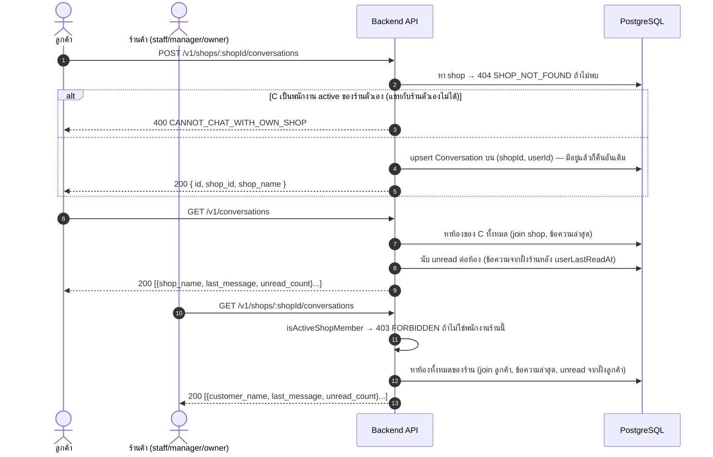
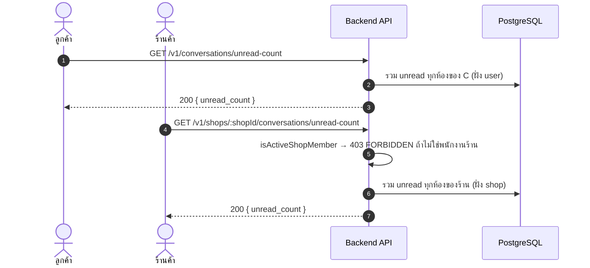

# Sequence Diagrams — แชทลูกค้า ↔ ร้านค้า

> อ้างอิงจาก `backend/src/routes/conversations.js`, `backend/src/services/realtime.js`
> ดูกลไก WebSocket ที่ใช้ร่วมกันเต็มๆ ที่ [11-realtime-websocket.md](./11-realtime-websocket.md)

ห้องแชทมีแบบเดียวต่อคู่ (ร้าน, ลูกค้า) เสมอ — unique constraint บน `(shopId, userId)` เปิดซ้ำได้แต่จะ
ได้ห้องเดิม ไม่สร้างซ้ำ

## 1. เปิดห้องแชท / ดูรายการห้อง



## 2. ส่งข้อความ (realtime) + มาร์คอ่านแล้ว

```mermaid
sequenceDiagram
    autonumber
    actor C as ลูกค้า
    participant API as Backend API
    participant PG as PostgreSQL
    participant WS as WebSocket
    actor Sh as ร้านค้า

    Note over C,Sh: ทั้งสองฝั่งต้อง join ห้อง conversation:&lt;id&gt; ทาง socket ไว้ก่อน<br/>(ดู 11-realtime-websocket.md) ถึงจะได้รับสัญญาณสด

    C->>API: GET /v1/conversations/:id/messages
    API->>PG: หาห้อง → 404 NOT_FOUND ถ้าไม่พบ
    API->>API: resolveSide(userId, conversation) — user หรือ shop หรือ null
    alt ไม่ใช่ทั้งสองฝั่ง
        API-->>C: 403 FORBIDDEN
    else
        API->>PG: หาข้อความทั้งหมดเรียงตามเวลา
        API-->>C: 200 { messages[], user_last_read_at, shop_last_read_at }
    end

    C->>API: POST /v1/conversations/:id/messages { message }
    alt ข้อความว่าง
        API-->>C: 400 MESSAGE_REQUIRED
    else ยาวเกิน 2000 ตัวอักษร
        API-->>C: 400 MESSAGE_TOO_LONG
    else resolveSide ไม่ผ่าน
        API-->>C: 403 FORBIDDEN
    else ผ่าน
        Note over API,PG: === transaction เดียว ===
        API->>PG: create ChatMessage { senderType:'user', message }
        API->>PG: update Conversation.lastMessageAt + มาร์คฝั่งตัวเองอ่านแล้ว
        API->>WS: emit('changed') เข้าห้อง conversation:&lt;id&gt;
        WS-->>Sh: แจ้งเตือนสด (ถ้า Sh join ห้องอยู่)
        API-->>C: 201 { id, sender_type, message, created_at }
    end

    Sh->>API: GET /v1/conversations/:id/messages (ได้แจ้งเตือนจาก socket แล้วมาโหลดใหม่)
    API-->>Sh: 200 &lt;ข้อความล่าสุดรวมของ C&gt;

    Sh->>API: PATCH /v1/conversations/:id/read
    API->>API: resolveSide → 403 FORBIDDEN ถ้าไม่ใช่คนในห้อง
    API->>PG: update shopLastReadAt = now
    Note right of API: จุดนี้ตั้งใจไม่ emit socket — กัน client ที่เพิ่ง<br/>reload จาก 'changed' มาเรียก endpoint นี้ แล้ว trigger ตัวเองเป็นลูป
    API-->>Sh: 204 No Content
```

## 3. นับข้อความยังไม่อ่าน (badge)


