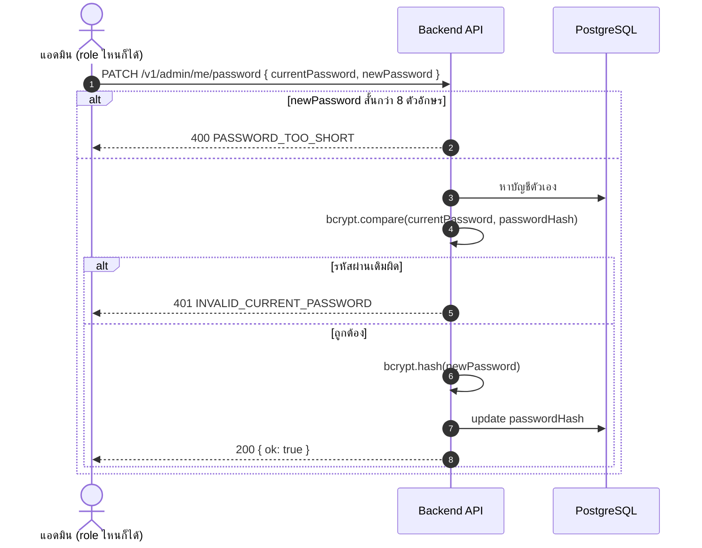
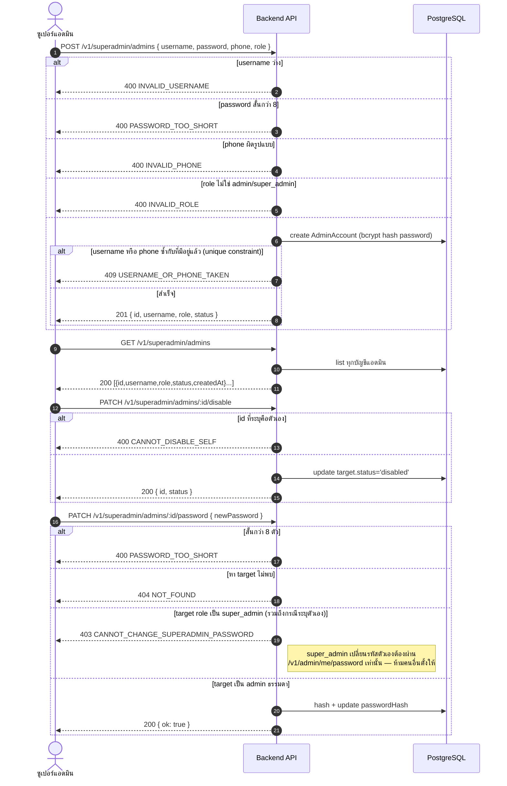
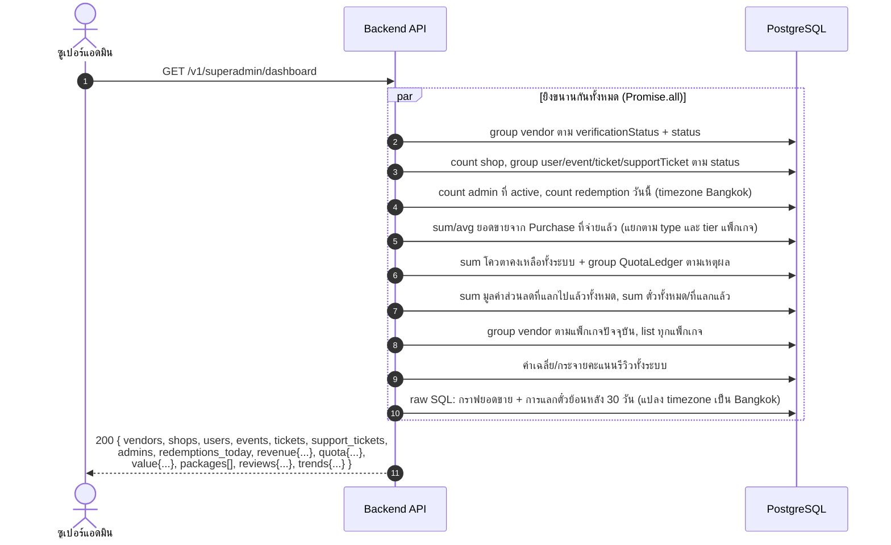

# Sequence Diagrams — Admin Accounts, User Moderation & Superadmin

> อ้างอิงจาก `backend/src/routes/{adminMe,superAdmin,superAdminDashboard,adminUsers,notifications}.js`,
> `backend/src/middleware/adminAuth.js`. Admin login เองอยู่ที่
> [01-auth-and-profile.md](./01-auth-and-profile.md) หัวข้อ 4

มี 2 role: `admin` (งานประจำวัน) กับ `super_admin` (คุมบัญชีแอดมินคนอื่น + ราคาแพ็กเกจ) — ตรวจสอบผ่าน
`requireAdminAuth` (ทุกเส้นทางในไฟล์นี้) และ `requireSuperAdmin` เพิ่มอีกชั้นเฉพาะเส้นทางของ super_admin

## 1. แอดมินเปลี่ยนรหัสผ่านตัวเอง



## 2. ซูเปอร์แอดมินจัดการบัญชีแอดมินคนอื่น



## 3. แอดมินดูแล/ระงับผู้ใช้ (ลูกค้า/ร้านค้า)

การระงับผู้ใช้คนละอย่างกับการระงับ vendor (ดู
[02-vendor-onboarding-and-moderation.md](./02-vendor-onboarding-and-moderation.md)) — ระงับผู้ใช้จะยกเลิก
**ตั๋วที่ผู้ใช้คนนั้นถืออยู่เอง** เท่านั้น ไม่แตะร้านค้า

```mermaid
sequenceDiagram
    autonumber
    actor A as แอดมิน
    participant API as Backend API
    participant PG as PostgreSQL

    A->>API: GET /v1/admin/users?status=&q=
    API->>PG: หา user ตามสถานะ/คำค้น (ชื่อหรือเบอร์) รวมนับตั๋ว/รีวิว/มีร้านไหม
    API-->>A: 200 [รายชื่อผู้ใช้ สูงสุด 200]

    A->>API: GET /v1/admin/users/:id
    API->>PG: หา user เต็ม (vendor ownerships, support ticket ที่เคยแจ้ง, สรุปตั๋วแยกตามสถานะ, รีวิว 20 ล่าสุด)
    alt ไม่พบ
        API-->>A: 404 NOT_FOUND
    else พบ
        API-->>A: 200 &lt;โปรไฟล์เต็ม&gt;
    end

    A->>API: POST /v1/admin/users/:id/suspend { reason }
    alt reason ว่าง
        API-->>A: 400 REASON_REQUIRED
    else หา user ไม่พบ
        API-->>A: 404 NOT_FOUND
    else
        Note over API,PG: === transaction เดียว ===
        API->>PG: conditional UPDATE status='suspended' WHERE status='active'
        alt count=0 (ระงับซ้ำ)
            API-->>A: 409 NOT_ACTIVE
        else สำเร็จ
            API->>PG: cancelTicketsHeldBy() — ยกเลิกตั๋ว AVAILABLE/ISSUED<br/>ที่ผู้ใช้นี้ถืออยู่ (ไม่คืนโควตาให้ร้าน — เป็นการลงโทษ)
            API->>PG: create Notification (type: account_suspended)<br/>อ่านได้แม้บัญชีถูกระงับ (ผ่าน /v1/notifications ที่ allow-suspended)
            API-->>A: 200 { id, status:'suspended', tickets_cancelled }
        end
    end

    A->>API: POST /v1/admin/users/:id/unsuspend
    API->>PG: หา user → 404 NOT_FOUND
    API->>PG: conditional UPDATE status='active' WHERE status='suspended'
    alt count=0 (ไม่ได้ถูกระงับอยู่)
        API-->>A: 409 NOT_SUSPENDED
    else สำเร็จ
        API->>PG: create Notification (type: account_restored)
        Note right of PG: ตั๋วที่ถูกยกเลิกไปตอน suspend **ไม่กลับมา** แม้ unsuspend แล้ว
        API-->>A: 200 { id, status:'active' }
    end
```

## 4. แดชบอร์ดซูเปอร์แอดมิน (สรุปทั้งระบบ)

`GET /v1/superadmin/dashboard` เป็น endpoint เดียว ไม่มี parameter —ยิงเกือบ 20 query ขนานกัน
(`Promise.all`) แล้วประกอบเป็น response ก้อนใหญ่ก้อนเดียว ไม่มี error branch พิเศษ (เป็น read-only
aggregate ล้วน)



## 5. แจ้งเตือนในแอป (ผลข้างเคียงของหลายๆ flow ข้างต้น)

ทุก flow ที่ "create Notification" ในไฟล์อื่นๆ ทั้งหมด (เชิญ staff, ผล verify vendor, ระงับ/ปลดระงับ,
แบนอีเวนต์, แชร์ตั๋ว) จบลงที่สองเส้นทางนี้ฝั่งผู้รับ — ใช้ `requireAuthAllowSuspended` เพราะแม้บัญชีถูก
ระงับก็ต้องอ่านการแจ้งเตือนเรื่องการระงับของตัวเองได้

```mermaid
sequenceDiagram
    autonumber
    actor U as ผู้ใช้ (แม้ถูกระงับก็อ่านได้)
    participant API as Backend API
    participant PG as PostgreSQL

    U->>API: GET /v1/notifications
    API->>PG: หา Notification ของ U เรียงใหม่สุดก่อน
    API-->>U: 200 [รายการแจ้งเตือน]

    U->>API: PATCH /v1/notifications/:id/read
    API->>PG: หา notification — ไม่พบ หรือไม่ใช่ของ U → 403 FORBIDDEN (ไม่แยก 404)
    API->>PG: update readAt = readAt เดิม ?? now (idempotent — กดซ้ำไม่ทับเวลาที่อ่านจริงครั้งแรก)
    API-->>U: 200 &lt;notification ที่อัปเดตแล้ว&gt;
```
