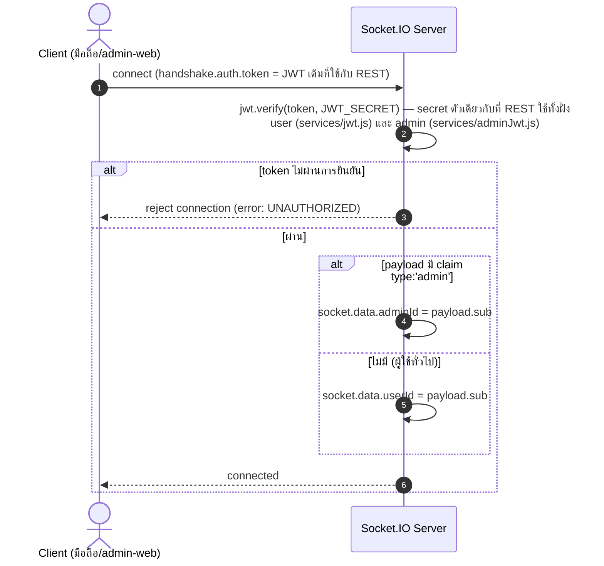
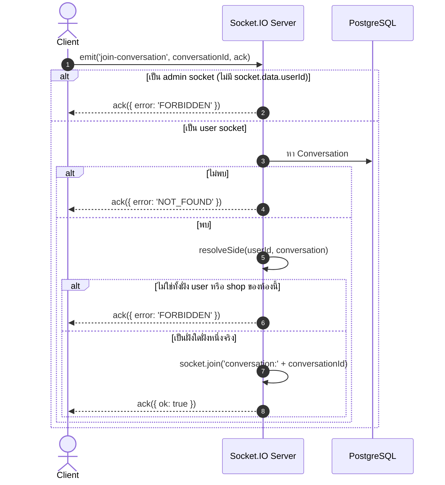
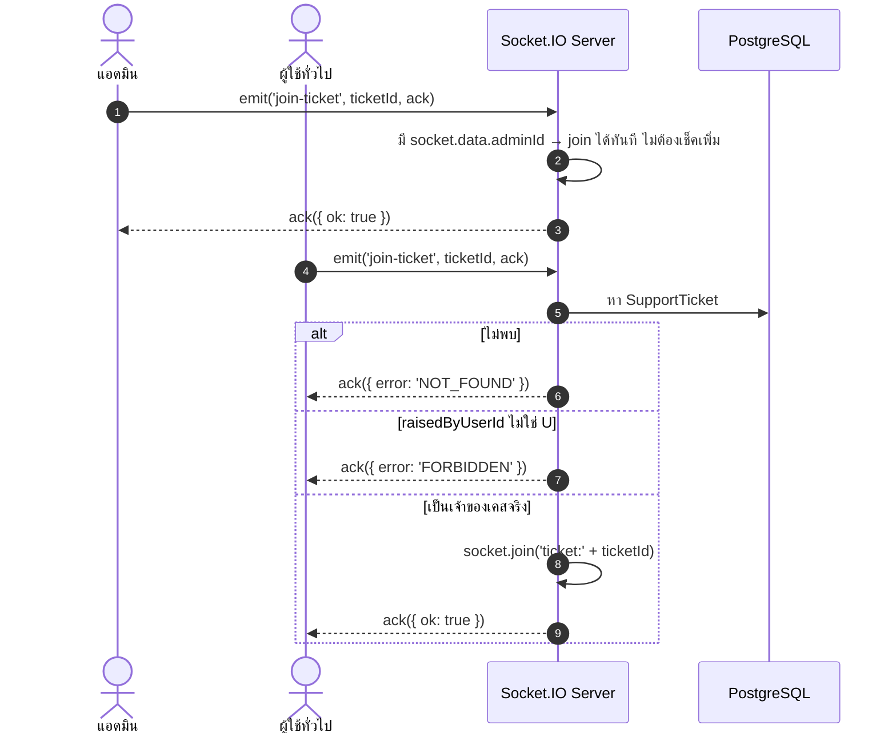

# Sequence Diagrams — Realtime (WebSocket)

> อ้างอิงจาก `backend/src/services/realtime.js`. เป็นชั้นเสริมของแชท ([08-chat.md](./08-chat.md))
> และ support ticket ([09-support-tickets.md](./09-support-tickets.md)) — ตัวมันเองไม่เก็บ/ส่งข้อมูล
> ธุรกิจใดๆ เลย มีหน้าที่แค่ "บอกให้ไปโหลดใหม่"

**หลักการออกแบบ**: socket ไม่เคยส่งเนื้อหาข้อความ/ข้อมูลจริงผ่านตัวมันเองเลยสักครั้ง — ส่งแค่สัญญาณ
`'changed'` แล้ว client ที่ได้รับจะไปเรียก REST endpoint เดิมเพื่อโหลดข้อมูลจริง ทำให้ REST ยังเป็น
"แหล่งข้อมูลจริงหนึ่งเดียว" (single source of truth) เสมอ กัน bug จาก state สองแหล่งไม่ตรงกัน และมี
REST polling ทุก 60 วินาทีเป็นระบบสำรองเผื่อ socket หลุดการเชื่อมต่อ

## 1. เชื่อมต่อ + auth (ใช้ JWT เดียวกับ REST)

## 2. Join ห้องแชท (`join-conversation`)

ใช้ฟังก์ชัน `resolveSide` **ตัวเดียวกับที่ REST endpoint ใช้เป๊ะ** (import ตรงจาก
`routes/conversations.js` ไม่ได้ copy โค้ดซ้ำ) — สิทธิ์การเข้าห้องผ่าน socket จึงตรงกับสิทธิ์ REST
เสมอ ไม่มีทางเพี้ยนแยกจากกัน

## 3. Join ห้อง Support Ticket (`join-ticket`)

แอดมิน join ห้องไหนก็ได้ทันที (ดูได้ทุกเคส) — ผู้ใช้ทั่วไป join ได้เฉพาะเคสของตัวเอง

## 4. ตารางสรุป Event ทั้งหมดที่ระบบส่งจริง

| Event | ห้อง/ขอบเขต | ยิงจากตรงไหน |
|---|---|---|
| `support-ticket-changed` | broadcast ทั้งระบบ (ไม่มีห้อง) | ผู้ใช้แจ้งปัญหาใหม่, ผู้ใช้ตอบกลับ, แอดมินอัปเดต/ตอบกลับ |
| `changed` | `ticket:&lt;supportTicketId&gt;` | ผู้ใช้ตอบกลับในเคส, แอดมินอัปเดต/ตอบกลับเคส |
| `changed` | `conversation:&lt;conversationId&gt;` | มีข้อความใหม่ในห้องแชท (ฝั่งไหนส่งก็ยิง) |

**จุดที่ตั้งใจไม่ยิง event** (กันเกิด refetch loop ตัวเองไม่รู้จบ): ทุก endpoint ที่แค่ "มาร์คว่าอ่านแล้ว"
(`PATCH /v1/conversations/:id/read`, การมาร์ค `userLastReadAt`/`adminLastReadAt` ที่เกิดขึ้นข้างใน GET
รายละเอียด) — เพราะ endpoint พวกนี้มักถูกเรียกจาก client ทันทีหลังได้รับสัญญาณ `'changed'` เอง ถ้ายิง
event ต่ออีกจะกลายเป็นวนซ้ำไม่จบ
