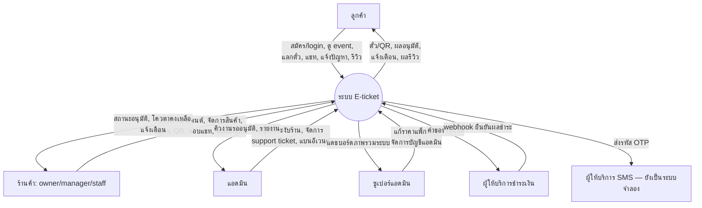
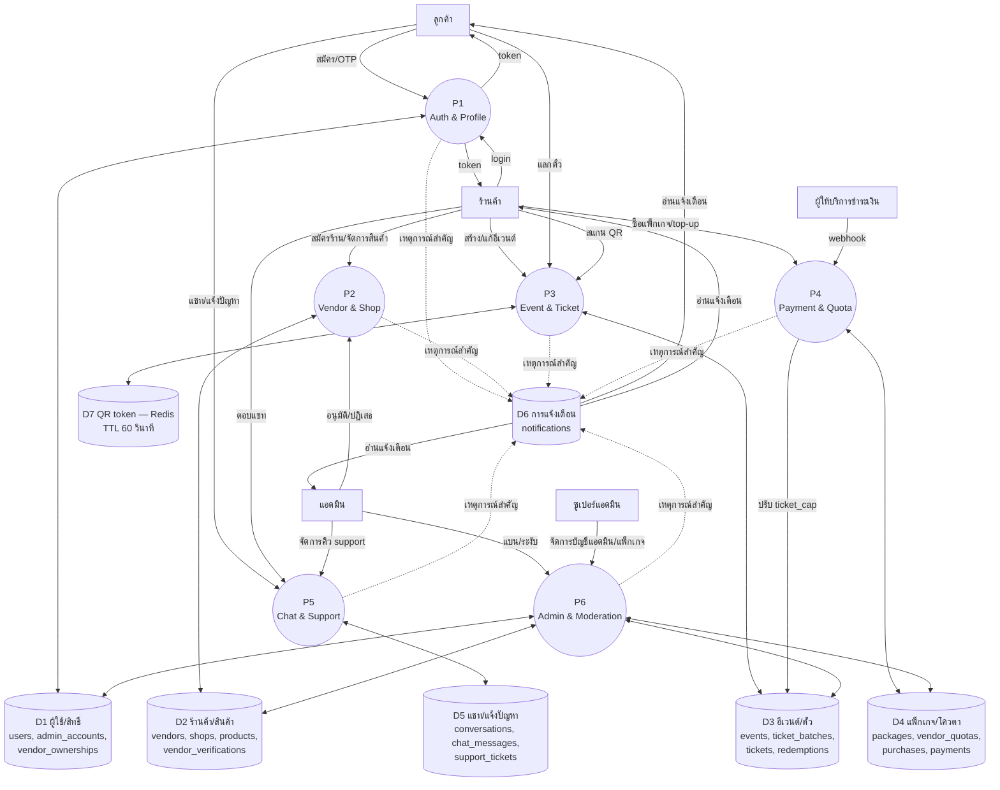

# Context Diagram + Data Flow Diagram (DFD)

> สัญลักษณ์ DFD มาตรฐาน (Gane-Sarson) จำลองด้วย mermaid flowchart: **external entity = สี่เหลี่ยม
> `[ ]`**, **process = วงกลม `(( ))`**, **data store = cylinder `[( )]`** — จัดกลุ่ม data store
> ตามกลุ่มความสามารถ ไม่ใช่ตารางเดียว ๆ (ตัวเต็มดู ERD [13-erd.md](./13-erd.md))

## Context Diagram (Level 0)

## Level 1 DFD (แตก process กลางเป็น 6 กลุ่มความสามารถ)

**หมายเหตุ**: เส้นประจาก P1-P6 ไป D6 หมายถึง "เขียน notification เมื่อมีเหตุการณ์ที่ผู้ใช้ต้องรู้"
(เช่น อนุมัติร้าน, ได้รับเชิญเป็นพนักงาน, ตั๋วถูกแชร์มา, ผลตัดสิน support ticket) ไม่ใช่ทุก process
เขียนทุกครั้ง — ดูรายชื่อ type จริงที่ใช้ทั้งหมดใน `Notification.type` (schema.prisma คอมเมนต์บรรทัด
377) และรายละเอียดที่ [11-realtime-websocket.md](./11-realtime-websocket.md) (WebSocket แค่บอก
"ไปโหลดใหม่" ไม่พกข้อมูลจริง)
