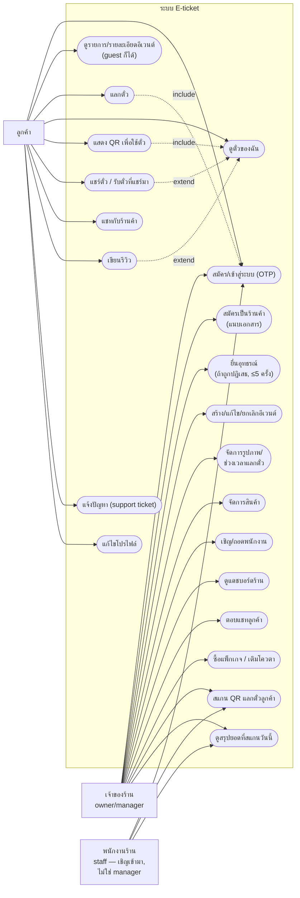
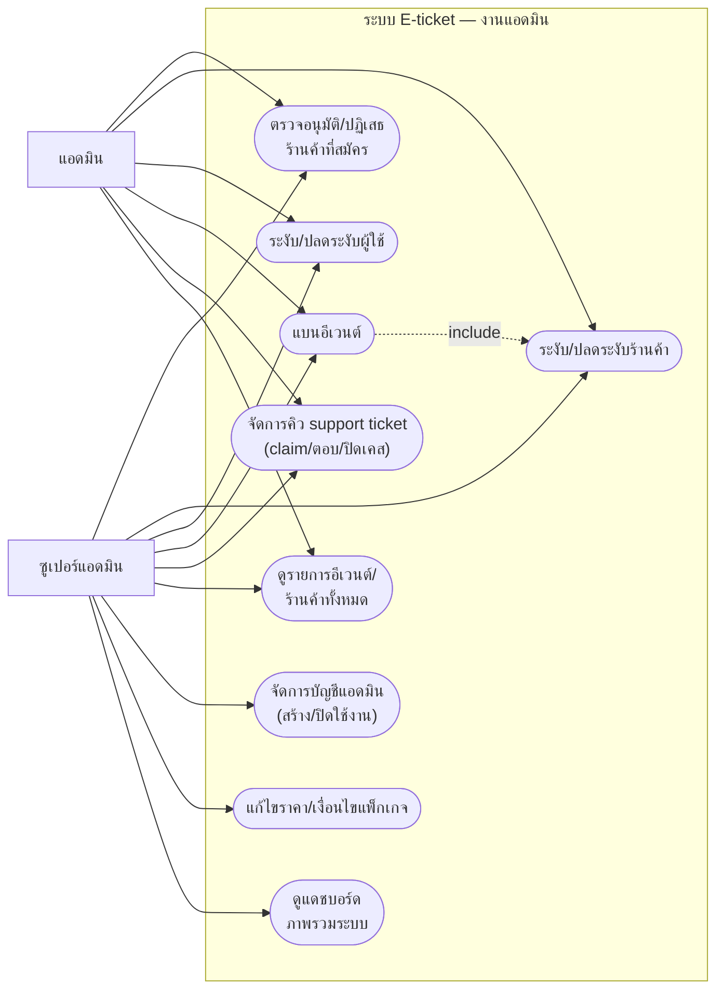

# Use Case Diagram

> mermaid ไม่มี UML use-case diagram แบบ native — จำลองด้วย flowchart: **actor = สี่เหลี่ยมนอก
> subgraph**, **use case = stadium shape `([ ])` ในกรอบ "ระบบ E-ticket"**, เส้นทึบ = actor ใช้
> use case นั้น, เส้นประ = ความสัมพันธ์ `<<include>>`/`<<extend>>` ที่มีจริงเชิงธุรกิจเท่านั้น
> (ไม่ใส่ทุกเส้นที่เป็นไปได้) — รายชื่อ actor อ้างจาก [00-index.md](./00-index.md) ตรงๆ

## 1. ฝั่งลูกค้า + ร้านค้า

**หมายเหตุ**: ปัจจุบัน role "manager" มีได้แค่คนเดียวต่อร้าน (คือคนที่สร้างร้าน — ได้ role นี้อัตโนมัติ)
ยังไม่มีทาง invite เพิ่ม manager คนที่สองในระบบตอนนี้ ในไดอะแกรมนี้จึงรวม owner/manager เป็น actor เดียว `เจ้าของร้าน` ตามของจริง

## 2. ฝั่งแอดมิน + ซูเปอร์แอดมิน

**หมายเหตุ**: `UC33 -.include.-> UC31` หมายถึง "แบนอีเวนต์" ไม่ใช่ use case แยกโดด ๆ — เกิดเป็น
ผลข้างเคียงเสมอเมื่อ "ระงับร้านค้า" (ฟังก์ชันร่วม `banEventsForShop` ใน
[02-vendor-onboarding-and-moderation.md](./02-vendor-onboarding-and-moderation.md) #4) รวมถึงเรียก
ตรงได้เองจากหน้าแอดมินต่ออีเวนต์เดียวด้วย ([04-event-lifecycle.md](./04-event-lifecycle.md) #4)
ซูเปอร์แอดมินมีสิทธิ์ทุกอย่างที่แอดมินธรรมดามี บวกเพิ่ม 3 use case ท้ายตาราง (จัดการบัญชีแอดมิน,
ราคาแพ็กเกจ, แดชบอร์ดภาพรวม)
