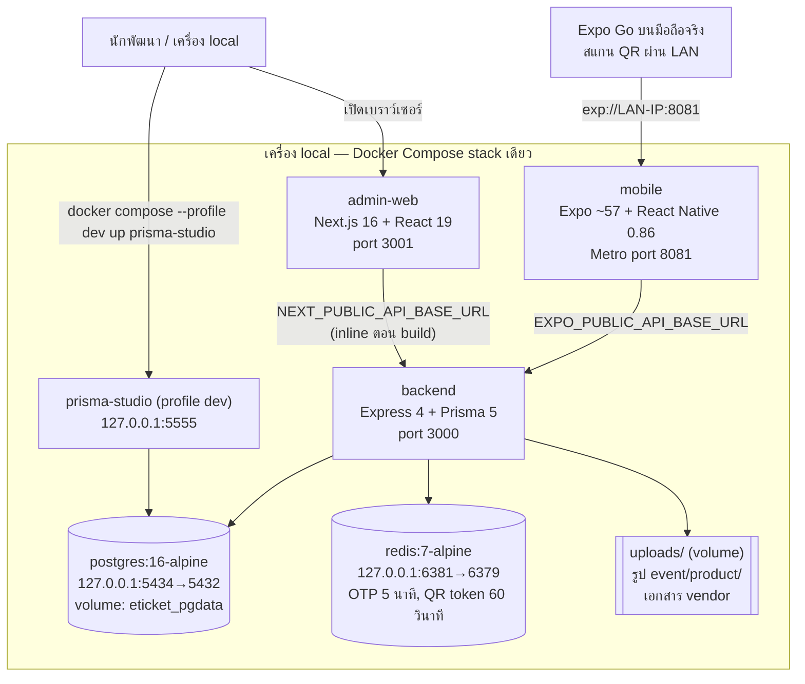
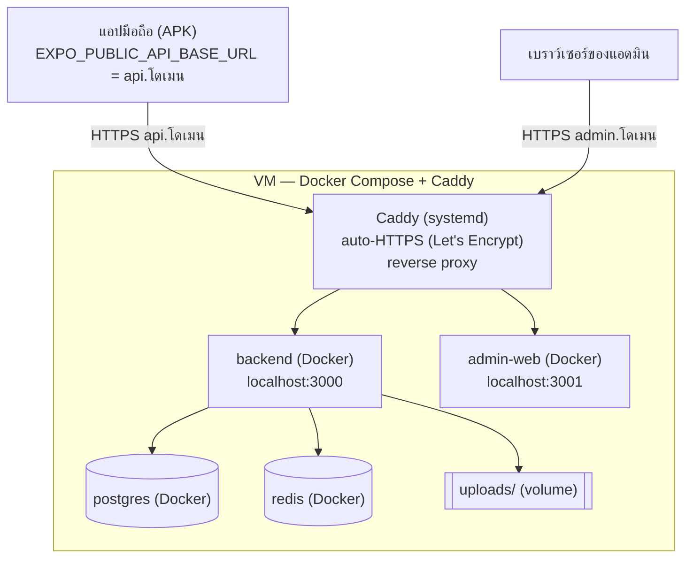

# System Architecture

> เอกสารเทคนิค — เวอร์ชันของแต่ละ tech เช็คจาก `backend/package.json`, `admin-web/package.json`,
> `mobile/package.json` ขั้นตอนติดตั้งจริงดู [docs/HANDOVER.md](../HANDOVER.md) หัวข้อ "ติดตั้งบนเซิร์ฟเวอร์"

## 1. Dev/Local — `docker compose up` บนเครื่องเดียว

ทุก service รันในเครื่องเดียวผ่าน `docker-compose.yml` (root ของ repo) — ใช้ตอนพัฒนา/ทดสอบ

**ข้อควรรู้**: `mobile`/`admin-web` container ไม่มี source volume mount — แก้โค้ดแล้วต้อง
`docker compose up -d --build <service>` ใหม่เสมอ ไม่ใช่แค่ `restart`

## 2. Production — VM เครื่องเดียว

ระบบต้นแบบติดตั้งบน VM เครื่องเดียว (Google Compute Engine e2-medium) บนเซิร์ฟเวอร์ไม่รัน service
`mobile` (Metro ใช้แค่ตอนพัฒนา — ผู้ใช้จริงติดตั้งแอปจาก APK ที่ build ด้วย EAS)

**ข้อจำกัดของรูปแบบนี้**:
- **เครื่องเดียว ไม่มี load balancer/CDN/หลาย instance** — ถ้าเครื่องล่ม ระบบล่มทั้งหมด
  (e2-medium ควรเปิด swap ไว้ เคยเจอ RAM หมดตอน build image)
- **postgres/redis เป็น container บนเครื่องเดียวกับ backend** ไม่ใช่ managed service — สำรองข้อมูลเอง
  (`pg_dump` + volume `eticket_uploads`)
- **ไม่มี secret manager และ CI/CD** — `.env` ทั้งสองไฟล์สร้างบนเครื่องเอง, deploy ด้วย `git pull` +
  `docker compose up -d --build`
